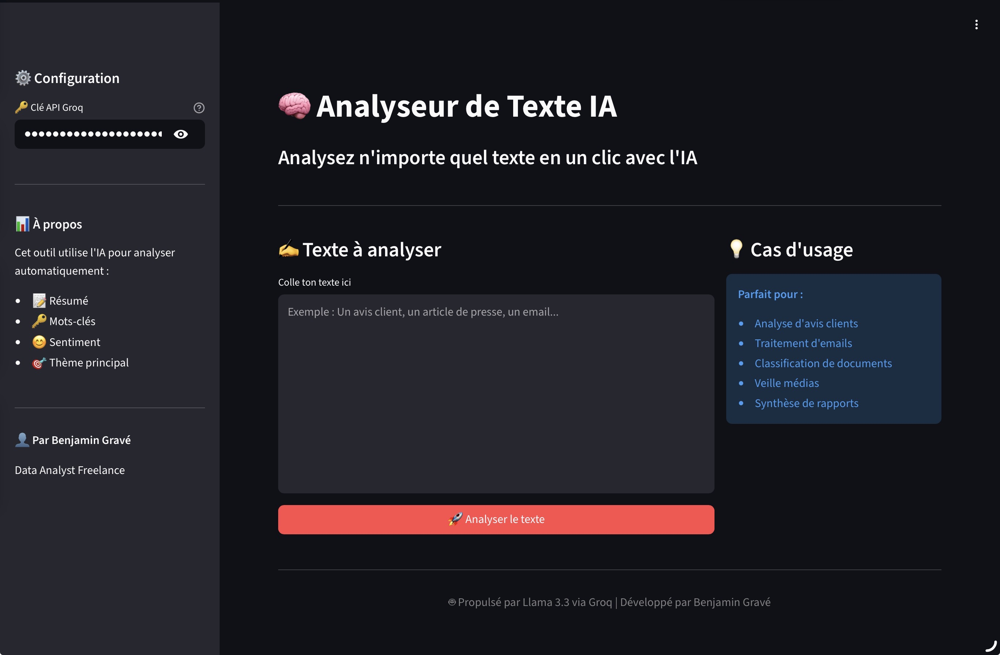

# 🧠 Analyseur de Texte IA - Application Web Streamlit

> Application web qui analyse n'importe quel texte avec l'IA et retourne un résumé, les mots-clés, le sentiment et le thème principal — le tout dans une interface moderne et intuitive.

## 🎯 Aperçu de l'application



*Remplace le nom du fichier ci-dessus par le nom exact de ta capture d'écran*

## 🎯 Objectif

Rendre l'analyse de texte par IA **accessible aux non-développeurs**. Plus besoin de savoir coder : il suffit d'ouvrir l'application, coller un texte, et cliquer sur un bouton.

## ⚙️ Fonctionnalités

- 📝 **Résumé automatique** en 2-3 phrases
- 🔑 **Extraction de mots-clés** pertinents
- 😊 **Analyse de sentiment** (positif/négatif/neutre avec score 0-10)
- 🎯 **Identification du thème principal**
- 📈 **Statistiques du texte** (caractères, mots, phrases)
- 🎨 **Interface web intuitive** utilisable sans coder

## 💼 Cas d'usage business

- 🛍️ **E-commerce** : Analyse automatique des avis clients
- 👥 **RH** : Traitement des feedbacks employés
- 📧 **Service client** : Classification des emails entrants
- 📰 **Veille** : Analyse de contenus presse/réseaux sociaux
- 🏢 **Management** : Synthèse de rapports internes

## 🛠️ Stack technique

- **Python 3**
- **Streamlit** — Framework d'applications web
- **Groq API** (Llama 3.3 70B) — Génération des analyses
- **Google Colab** + **ngrok** — Déploiement et tunneling

## 🚀 Installation et utilisation

### Prérequis
- Python 3.10+
- Une clé API Groq (gratuite sur [console.groq.com](https://console.groq.com))

### Lancer l'application localement

```bash
# Installer les dépendances
pip install streamlit groq

# Lancer l'app
streamlit run app.py
```

### Lancer depuis Google Colab

1. Ouvrir le notebook `Phase13_streamlit_analyseur_texte.ipynb`
2. Exécuter les cellules dans l'ordre
3. Utiliser ngrok pour exposer l'app
4. Cliquer sur l'URL générée

## 🔒 Sécurité

La clé API n'est **jamais** stockée dans le code. Elle est saisie dynamiquement par l'utilisateur au moment de l'utilisation.

## 🎯 Évolutions possibles

- 📤 Upload de fichiers texte/PDF
- 📊 Graphiques interactifs (sentiments au fil du texte)
- 💾 Historique des analyses
- 🌍 Multi-langues avancé
- 🔗 Intégration API pour clients

## 👤 Auteur

**Benjamin Gravé** - Data Analyst Freelance

🔗 [LinkedIn](https://linkedin.com/in/benjamin-gravé-217a0517)

---

*Projet développé dans le cadre d'une formation Data Analyst / IA - Avril 2026*
